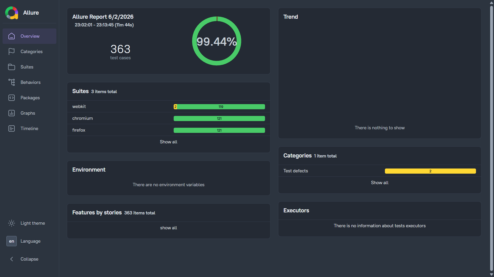

# Playwright Capstone Project

This repository contains a Playwright-based automation testing framework developed as part of the Wipro QA Automation Capstone Project. The framework automates key user journeys, validates application functionality across multiple modules, and generates detailed execution reports using Allure.

The project supports cross-browser testing on Chromium, Firefox, and WebKit while following structured and maintainable test automation practices.

---

## Allure Test Report:  
### [View Allure Report](https://allurer-report.netlify.app/)

The report contains detailed test execution results, pass/fail statistics, execution trends, and test artifacts generated during automation runs. <br>
*(Click the link above to view the latest report)*

---
## Website Under Testing: [Blinkit](https://blinkit.com/)
Blinkit was selected as the application under test due to its popularity as a large-scale e-commerce platform and its stable, production-grade environment. The platform offers a wide range of user workflows, including authentication, product search, product browsing, cart management, and store interactions, making it suitable for comprehensive automation testing.

Its reliability and consistent availability allow test cases to be executed with minimal disruption from server outages or application instability, enabling a greater focus on validating functionality, user experience, and automation framework design.

---
## Project Objectives
- Develop an end-to-end automation framework using Playwright
- Automate critical user journeys on the Blinkit platform
- Validate UI functionality across multiple application modules
- Execute automated tests across Chromium, Firefox, and WebKit
- Generate detailed execution reports using Allure
- Apply industry-standard automation testing practices
- Improve test maintainability through reusable and scalable test design
---
### Project Scope
The project includes automation testing across multiple functional modules of the Blinkit web application.

- A minimum of *8 modules* (implemented: ***9 modules***)
- *80+ test cases* required (implemented: ***120 test cases***)
---

## Modules Covered
#### 1. Homepage & Navigation (HN)

- Validates homepage accessibility, location selection, navigation elements, and movement between different sections of the application.

#### 2. Search Functionality (S)

- Verifies product search, search suggestions, search result accuracy, and product discovery workflows.

#### 3. Product Listing Page (PL)

- Validates product listings, product cards, pricing information, product images, and navigation to product details pages.

#### 4. Product Details Page (PD)

- Verifies product-specific information including product names, descriptions, pricing, images, and product details.

#### 5. Cart Functionality (CT)

- Validates add-to-cart operations, quantity updates, item removal, cart contents, and cart-related workflows.

#### 6. Checkout Flow (CF)

- Confirms user can proceed from cart to checkout without UI or navigation issues.

#### 7. Authentication (AT)

- Verifies user login functionality, account access, session persistence, and authentication-related workflows.

#### 8. Store Navigation (SN)

- Validates store navigation, category selection, product availability, and store-specific interactions.

#### 9. Responsive & Mobile UI Testing (MI)

- Validates layout stability, UI rendering, and interaction behavior across screen sizes and devices.
---

## Project Structure

```text
Playwright-Capstone-Project/
│
├──.github/
│      └── workflows/
│             └── playwright.yml                    
├── allure-report/              # Generated Allure report
├── allure-results/             # Raw Allure test results
├── doc/                        # Project Document File
├── fixtures/                   # Contains Fixtures
├── node_modules/
├── pages/
├── playwright-report/         # Playwright HTML report
├── test-results/               # Playwright test artifacts
├── tests/
│   ├── 01_homepageNavigation
│   │            └── home.spec.js
│   ├── 02_searchFunctionality
│   │            └── search.spec.js
│   ├── 03_productListing
│   │            └── productListing.spec.js
│   ├── 04_productDetails
│   │            └── productDetails.spec.js
│   ├── 05_cartFunctionality
│   │            └── cart.spec.js
│   ├── 06_checkoutFlow
│   │            └── checkout.spec.js
│   ├── 07_authentication
│   │            ├── auth.spec.js
│   │            └── loggedIn.spec.js
│   ├── 08_storeFunctionality
│   │            └── store.spec.js
│   └── 09_responsiveBrowserUI
│                └── responsive.spec.js
├── .env`   
├── .gitignore                              
├── auth.json                  # Stored authentication state (in private)
├── package.json
├── package-lock.json
├── playwright.config.ts
├── tsconfig.json
└── README.md
```
---
## Browser Coverage

The automation suite has been validated across the following browser engines:

* Chromium
* Firefox
* WebKit

Cross-browser execution ensures consistent functionality and user experience across different browser environments.

---
## Installation and Running Tests
Clone the repository
```bash
git clone https://github.com/AryanMohanty04/playwright-capstone-project.git
```
Install dependencies:
```bash
npm install
```
Install Playwright
```bash
npm init playwright@latest
```
Run all tests:
```bash
npx playwright test
```
Run tests in headed mode:
```bash
npx playwright test --headed
```
Run specific file 
```bash
npx playwright test tests.example.filepath.spec.js
```
Run tests on particular browser:
```bash
npx playwright test --project=chromium
npx playwright test --project=firefox
npx playwright test --project=webkit
```
---
## Reporting

This project uses **Allure Reporting** to generate detailed test execution reports, including test results, execution statistics, screenshots, and failure analysis.

### Install Allure

```bash
npm install -D allure-playwright
```

Install Allure Commandline:

```bash
npm install -g allure-commandline --save-dev
```

### Execute Tests

Run the test suite to generate Allure results:

```bash
npx playwright test
```

### Generate Allure Report

```bash
allure generate allure-results --clean -o allure-report
```

### Open Allure Report

```bash
allure open allure-report
```

### Regenerate Report (If Report Data Is Incorrect)

If an outdated or incorrect report is generated, delete the existing report data and execute the tests again:

```bash
rm -rf allure-results allure-report
```

Run the tests again:

```bash
npx playwright test
```

Generate a fresh report:

```bash
allure generate allure-results --clean -o allure-report
```

### Playwright HTML Report

Generate and open the default Playwright report:

```bash
npx playwright show-report
```
---
## Test Suite Summary

| Metric           | Value      |
| ---------------- | ---------- |
| Total Modules    | 9          |
| Total Test Cases | 120        |
| Browsers Covered | 3          |
| Reporting Tool   | Allure     |
| Framework        | Playwright |
| Language         | JavaScript |

--- 
## Author

**Aryan Mohanty**

QA Automation Capstone Project – Wipro Training

* GitHub: https://github.com/AryanMohanty04

---

## Acknowledgements

Special thanks to the project mentor for their guidance, feedback, and support throughout the development of this project.

* GitHub: https://github.com/aryan1403

